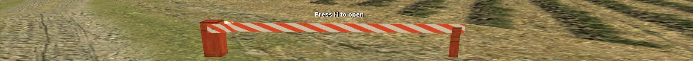

# easy-barrier 
A lightweight and powerful library for creating automated gates, doors, and barriers in SA-MP.
Simplifies object movement with 100+ predefined presets and easy-to-use trigger zones.



## Reference
* [Installation](#installation)
* [Example](#example)
* [Functions](#functions)
* [Callback](#callback)
* [Definition](#definition)

## Installation

Include in your code and begin using the library:
```pawn
#include <easy-barrier>
```

## Example

```pawn
new barrierid = CreateBarrier("Police_Department", 
    3.0, 0.5, 0, 19302, 
    24.637180, -8.755125, 3.397187, 0.000000, 0.000000, 86.175994, 0, 0);

SetBarrierOpeningType(barrierid, EB_MOVEMENT_TYPE_RIGHT);


// attach
new barrierid2 = CreateBarrier("Police_Department", 
    3.0, 0.5, 0, 19302, 
    24.637180, -6.755125, 3.397187, 0.000000, 0.000000, 86.175994, 0, 0);

SetBarrierOpeningType(barrierid2, EB_MOVEMENT_TYPE_LEFT);
AttachBarrierToBarrier(barrierid, barrierid2);


BarrierResponse:Police_Department(playerid, barrierid) {

    if(GetPlayerSkin(playerid) != 283) {
        SendClientMessage(playerid, 0xFF0000AA, "Only for cops");
        return 1;
    }

    SendClientMessage(playerid, -1, "barrier for police open");
    return 0;
}


// optional for changing the material
forward OnBarrierObjectCreated(barrierid, objectid, modelid);
public OnBarrierObjectCreated(barrierid, objectid, modelid) {

    switch(modelid) {
        case 968: {
            SetDynamicObjectMaterial(objectid, 1, 3306, "cunte_house1", "sw_patiodoors", 0);
        }
    }

    return 1;
}


forward OnBarrierEnter(playerid, barrierid, keys);
public OnBarrierEnter(playerid, barrierid, keys) {

    new function[32];
    GetBarrierFunctionName(barrierid, function);

    new string[64];
    format(string, sizeof(string), "Barrier Enter: %d | Keys: %d | Function: %s", barrierid, keys, function);
    SendClientMessage(playerid, -1, string);
    return 1;
}


forward OnBarrierLeave(playerid, barrierid);
public OnBarrierLeave(playerid, barrierid) {

    new function[32];
    GetBarrierFunctionName(barrierid, function);

    new string[64];
    format(string, sizeof(string), "Barrier Leave: %d | Function: %s", barrierid, function);
    SendClientMessage(playerid, -1, string);
    return 1;
}
```

## Functions
<details>
<summary>Click to expand the list</summary>

#### CreateBarrier(const function[], Float:radius, Float:moveSpeed, closingSeconds, modelid, Float:x, Float:y, Float:z, Float:rx, Float:ry, Float:rz, worldid = -1, interiorid = -1, barrierState = EB_STATE_PLAYER_AND_DRIVER, const text3D[] = "", text3DColor = -1, Float:text3DDistance = 6.0, Float:triggerX = 0.0, Float:triggerY = 0.0, Float:triggerZ = 0.0, key = 0)
> Create a barrier
> * `function[]` - Function name
> * `Float:radius` - Trigger distance
> * `Float:moveSpeed` - The speed at which to move the object (units per second)
> * `closingSeconds` - Closing time (use the value 0, for manual opening/closing)
> * `modelid` - The model
> * `Float:x` - The x coordinate to create the object
> * `Float:y` - The y coordinate to create the object
> * `Float:z` - The z coordinate to create the object
> * `Float:rx` - The x rotation of the object
> * `Float:ry` - The y rotation of the object
> * `Float:rz` - The z rotation of the object
> * `worldid` - The virtual world ID
> * `interiorid` - The interior ID
> * `barrierState` - Barrier status
> * `text3D[]` - 3DText
> * `text3DColor` - 3DText color
> * `Float:text3DDistance` - 3DText draw distance
> * `Float:triggerX` - The x coordinate to trigger zone
> * `Float:triggerY` - The y coordinate to trigger zone
> * `Float:triggerZ` - The z coordinate to trigger zone
> * `key` - Interaction key (use 0 for default keys defined by EB_KEY_STATE_ONFOOT or EB_KEY_STATE_DRIVER)
> * Returns (-1) on failure or (barrier id)

#### DestroyBarrier(barrierid)
> Remove the barrier
> * `barrierid` - The ID of the barrier
> * Returns (-1) on failure or barrier id

#### IsValidBarrier(barrierid)
> Check if the barrier ID is valid
> * `barrierid` - The ID of the barrier
> * Returns (0) if the barrier ID is invalid, (1) if the barrier ID is valid

#### BarrierOpen(barrierid)
> Open the barrier
> * `barrierid` - The ID of the barrier
> * Returns (-1) on failure or (1) on success

#### BarrierClose(barrierid)
> Close the barrier
> * `barrierid` - The ID of the barrier
> * Returns (-1) on failure or (1) on success

#### IsBarrierOpen(barrierid)
> Get the barrier status
> * `barrierid` - The ID of the barrier
> * Returns (0) if closed, (1) if open, (-1) if failed

#### SetBarrierOpeningType(barrierid, type, Float:percent = 100.0)
> Set the type of movement
> * `barrierid` - The ID of the barrier
> * `type` - Type of movement
> * `percent` - Percentage of movement
> * Returns (-1) on failure or (1) on success

#### SetBarrierMovementX(barrierid, Float:x)
> Set the target X coordinate for the movement
> * `barrierid` - The ID of the barrier
> * `Float:x` - The x coordinate
> * Returns (-1) on failure or (1) on success

#### SetBarrierMovementY(barrierid, Float:y)
> Set the target Y coordinate for the movement
> * `barrierid` - The ID of the barrier
> * `Float:y` - The y coordinate
> * Returns (-1) on failure or (1) on success

#### SetBarrierMovementZ(barrierid, Float:z)
> Set the target Z coordinate for the movement
> * `barrierid` - The ID of the barrier
> * `Float:z` - The z coordinate
> * Returns (-1) on failure or (1) on success

#### SetBarrierMovementRX(barrierid, Float:rx)
> Set the target RX coordinate for the movement
> * `barrierid` - The ID of the barrier
> * `Float:rx` - The rx coordinate
> * Returns (-1) on failure or (1) on success

#### SetBarrierMovementRY(barrierid, Float:ry)
> Set the target RY coordinate for the movement
> * `barrierid` - The ID of the barrier
> * `Float:ry` - The ry coordinate
> * Returns (-1) on failure or (1) on success

#### SetBarrierMovementRZ(barrierid, Float:rz)
> Set the target RZ coordinate for the movement
> * `barrierid` - The ID of the barrier
> * `Float:rz` - The rz coordinate
> * Returns (-1) on failure or (1) on success

#### SetBarrierMove(barrierid, Float:x, Float:y, Float:z, Float:rx, Float:ry, Float:rz)
> Set the positions of the moving object
> * `barrierid` - The ID of the barrier
> * `Float:x` - The x coordinate
> * `Float:y` - The y coordinate
> * `Float:z` - The z coordinate
> * `Float:rx` - The x rotation of the object
> * `Float:ry` - The y rotation of the object
> * `Float:rz` - The z rotation of the object
> * Returns (-1) on failure or (1) on success

#### AttachBarrierToBarrier(barrierid, attachid)
> Attach barrier to barrier
> * `barrierid` - The ID of the barrier
> * `attachid` - The ID of the barrier to attach
> * Returns (-1) on failure or (1) on success

#### UnAttachBarrierFromBarrier(barrierid, attachid)
> UnAttach the barrier from the barrier
> * `barrierid` - The ID of the barrier
> * `attachid` - The ID of the barrier to attach
> * Returns (-1) on failure or (1) on success

#### SetBarrierClosingTime(barrierid, seconds)
> Set barrier closing time
> * `barrierid` - The ID of the barrier
> * `seconds` - Closing time (use the value 0 for manual opening/closing)
> * Returns (-1) on failure or (1) on success

#### GetBarrierClosingTime(barrierid)
> Get barrier closing time
> * `barrierid` - The ID of the barrier
> * Returns (-1) on failure or (second)

#### SetBarrierMoveSpeed(barrierid, Float:speed)
> Set the speed of a moving object
> * `barrierid` - The ID of the barrier
> * `Float:speed` - The speed at which to move the object (units per second)
> * Returns (-1) on failure or (1) on success

#### Float:GetBarrierMoveSpeed(barrierid)
> Get the speed of a moving object
> * `barrierid` - The ID of the barrier
> * Returns (-1) on failure or (speed)

#### SetBarrierTrigger(barrierid, Float:x, Float:y, Float:z)
> Set trigger zone
> * `barrierid` - The ID of the barrier
> * `Float:x` - The x coordinate to trigger zone
> * `Float:y` - The y coordinate to trigger zone
> * `Float:z` - The z coordinate to trigger zone
> * Returns (-1) on failure or (1) on success

#### GetBarrierTrigger(barrierid, &Float:x, &Float:y, &Float:z)
> Get trigger zone
> * `barrierid` - The ID of the barrier
> * `&Float:x` - The x coordinate to trigger zone
> * `&Float:y` - The y coordinate to trigger zone
> * `&Float:z` - The z coordinate to trigger zone
> * Returns (-1) on failure or (1) on success

#### SetBarrierTriggerExtra(barrierid, Float:x, Float:y, Float:z, Float:radius, barrier_state = EB_STATE_PLAYER_ONLY, key = EB_KEY_STATE_ONFOOT)
> Set trigger extra 
> * `barrierid` - The ID of the barrier
> * `Float:x` - The x coordinate to trigger zone
> * `Float:y` - The y coordinate to trigger zone
> * `Float:z` - The z coordinate to trigger zone
> * `Float:radius` - Trigger distance
> * `barrierState` - Barrier status
> * `key` - Interaction button
> * Returns (-1) on failure or (1) on success

#### GetBarrierTriggerExtra(barrierid, &Float:x, &Float:y, &Float:z, &Float:radius = 0.0, &barrierState = 0, &key = 0)
> Get trigger extra 
> * `barrierid` - The ID of the barrier
> * `Float:x` - The x coordinate to trigger zone
> * `Float:y` - The y coordinate to trigger zone
> * `Float:z` - The z coordinate to trigger zone
> * `Float:radius` - Trigger distance
> * `barrierState` - Barrier status
> * `key` - Interaction button
> * Returns (-1) on failure or (1) on success

#### GetBarrierIDByFunction(const function[])
> Get barrier ID
> * `function[]` - Function name
> * Returns (-1) on failure or barrier id
> * NOTE: If multiple barriers use the same function name, it will return the closest barrier ID.

#### SetBarrierState(barrierid, barrierState)
> Set the barrier status
> * `barrierid` - The ID of the barrier
> * `barrierState` - Barrier status
> * Returns (-1) on failure or (1) on success

#### GetBarrierState(barrierid)
> Get Barrier status
> * `barrierid` - The ID of the barrier
> * Returns (-1) on failure or (status)

#### SetBarrierKey(barrierid, key)
> Set barrier key
> * `barrierid` - The ID of the barrier
> * `key` - Interaction button
> * Returns (-1) on failure or (1) on success

#### GetBarrierKey(barrierid)
> Get barrier key
> * `barrierid` - The ID of the barrier
> * Returns (-1) on failure or (key)

#### GetBarrierObjectID(barrierid, &moveid, &extraid = 0)
> Get the barrier object ID
> * `barrierid` - The ID of the barrier
> * `&moveid` - moving object id
> * `&extraid` - additional object id
> * Returns (-1) on failure or (1) on success

#### BarrierCreateExtraObject(barrierid, modelid, Float:x, Float:y, Float:z, Float:rx, Float:ry, Float:rz, worldid = -1, interiorid = -1)
> Create a second extra object
> * `barrierid` - The ID of the barrier
> * `modelid` - The model ID
> * `Float:x` - The x coordinate to create the object
> * `Float:y` - The y coordinate to create the object
> * `Float:z` - The z coordinate to create the object
> * `Float:rx` - The x rotation of the object
> * `Float:ry` - The y rotation of the object
> * `Float:rz` - The z rotation of the object
> * `worldid` - The virtual world ID
> * `interiorid` - The interior ID
> * Returns (-1) on failure or (1) on success

#### DestroyBarrierExtraObject(barrierid)
> Delete an extra barrier object
> * `barrierid` - The ID of the barrier
> * Returns (-1) on failure or (1) on success

#### UpdateBarrierText(barrierid, const text[], color = 0)
> Set 3D Text
> * `barrierid` - The ID of the barrier
> * `text[]` - text
> * `color` - Color
> * Returns (-1) on failure or (1) on success

#### GetBarrierText(barrierid, text[], size = sizeof(text))
> Get Text 3D text
> * `barrierid` - The ID of the barrier
> * `&text` - text
> * `size = sizeof(text)` - sizeof
> * Returns (-1) on failure or (1) on success

#### SetBarrierTextColor(barrierid, color)
> Set 3D text color
> * `barrierid` - The ID of the barrier
> * `color` - Color
> * Returns (-1) on failure or (1) on success

#### GetBarrierTextColor(barrierid)
> Get 3D text color
> * `barrierid` - The ID of the barrier
> * Returns (-1) on failure or (color) on success

#### SetBarrierTextPosition(barrierid, Float:x, Float:y, Float:z)
> Set position of 3D text
> * `barrierid` - The ID of the barrier
> * `Float:x` - The x coordinate
> * `Float:y` - The y coordinate
> * `Float:z` - The z coordinate
> * Returns (-1) on failure or (1) on success

#### IsBarrierFunction(barrierid, function[])
> Check if the barrier uses a specific function name (similar to strcmp)
> * `barrierid` - The ID of the barrier
> * `function[]` - Function name

#### GetBarrierFunctionName(barrierid, function[], size_function = sizeof(function))
> Get barrier function name
> * `barrierid` - The ID of the barrier
> * `function[]` - Function name
> * Returns (-1) on failure or (function)

#### DisableBarrier(barrierid, bool:disable)
> Disable barrier
> * `barrierid` - The ID of the barrier
> * ` bool:disable` - state

#### IsBarrierDisabled(barrierid)
> Is the barrier disabled
> * `barrierid` - The ID of the barrier
> * Returns (-1) on failure or (state)
</details>

## Callback
<details>
<summary>Click to expand the list</summary>

#### BarrierResponse:const function[](playerid, barrierid)
> Called when interacting with a barrier
> * `const function[]` - Function name
> * `playerid` - The ID of the player
> * `barrierid` - The ID of the barrier
> * NOTE: Always use 'return 0;' if you need to activate the barrier

#### public OnBarrierObjectCreated(barrierid, objectid, modelid)
> Called when creating a barrier
> * `barrierid` - The ID of the barrier
> * `objectid` - Object ID
> * `modelid` - Object model

#### public OnBarrierEnter(playerid, barrierid, keys)
> Called when a trigger zone is entered
> * `playerid` - The ID of the player
> * `barrierid` - The ID of the barrier
> * `keys` - Interaction button

#### OnBarrierLeave(playerid, barrierid)
> Called when the trigger zone is left
> * `playerid` - The ID of the player
> * `barrierid` - The ID of the barrier
</details>


## Definition
<details>
<summary>Click to expand the list</summary>
	
| State                             | value  | Description |
| ----------------------------------| ------ | ----------- |
| `EB_STATE_PLAYER_AND_DRIVER`		| -1     | The barrier will work for both players and drivers |
| `EB_STATE_PLAYER_ONLY`		    | 1      | The barrier will work only for players |
| `EB_STATE_DRIVER_ONLY`		    | 2      | The barrier will work only for drivers |

| Movement                          | value  | Description |
| ----------------------------------| ------ | ----------- |
| `EB_MOVEMENT_TYPE_OUTSIDE`	    | 0      | The barrier will move outside |
| `EB_MOVEMENT_TYPE_INSIDE`		    | 1      | The barrier will move inside |
| `EB_MOVEMENT_TYPE_RIGHT`		    | 2      | The barrier will move to the right |
| `EB_MOVEMENT_TYPE_LEFT`		    | 3      | The barrier will move to the left |
| `EB_MOVEMENT_TYPE_UP`		        | 4      | The barrier will move up |
| `EB_MOVEMENT_TYPE_DOWN`		    | 5      | The barrier will move down |


```pawn
#define EB_INVALID_ID -1

#define EB_MAX_BARRIERS 200
#define EB_MAX_ATTACH 10
#define EB_LENGTH_FUNCTION_NAME 32

#define EB_KEY_STATE_ONFOOT KEY_WALK
#define EB_KEY_STATE_DRIVER KEY_CROUCH

#define EB_3DTEXT_LENGTH 144
#define EB_DISTANCE_OBJECT 150.0

#define EB_SKIP_EXTRA_OBJECT //Оnly for model 968, if you want to skip creating extra object for this model, uncomment this line
```
</details>
